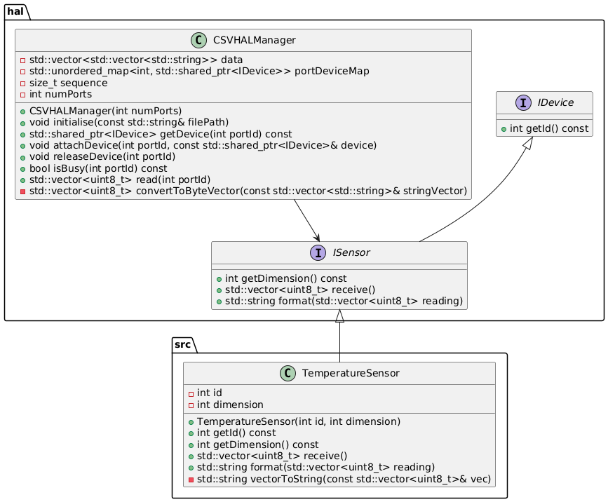

# Activity 1: Explore a simple Hardware Abstraction Layer (HAL)

[<--back](./README.md)

In this activity you just need to go through the files provided and understand how these works. You will use these files in the next activity.

## [IDevice](src/hal/IDevice.h)

The IDevice interface is the component of the HAL that provides a common interface for all devices (e.g. sensors). It ensures that all devices can be managed in a consistent manner by the `CSVHALManager`, facilitating the attachment, release, reading, and writing of devices. Derived interfaces like `ISensor` and `IActuator` extend IDevice to add functionality specific to sensors and actuators, respectively. 

## [ISensor](src/hal/ISensor.h)

The `ISensor` interface extends `IDevice` and defines additional methods specific to sensors, including `getDimension()` and `format()`. The `getId()` method from `IDevice` indicates the starting column to read sensor data from the CSV file, while `getDimension()` specifies how many measurements the sensor produces. The `format()` method is used to format the sensor readings.

## [CSVHALManager](src/hal/CSVHALManager.h)

The `CSVHALManager` class is designed to manage hardware abstraction layer (HAL) devices, such as sensors and actuators, using data from a CSV file. It provides functionality to initialize, attach, release, read from, and write to devices connected to various ports. The devices are managed through the `IDevice` interface, which ensures a consistent structure for all devices, allowing the `CSVHALManager` to handle different types of devices in a unified manner.

### Private Members
- **data**: A `std::vector` of `std::vector<std::string>` that stores the CSV data.
- **portDeviceMap**: An `std::unordered_map` that maps port IDs to `std::shared_ptr<IDevice>`, representing the devices attached to each port.
- **sequence**: A `size_t` that keeps track of the current row index in the CSV data.
- **numPorts**: An `int` that stores the total number of ports.

### Private Methods

- **convertToByteVector**: Converts a `std::vector<std::string>` to a `std::vector<uint8_t>`.

### Public Methods
- **CSVHALManager(int numPorts)**: Constructor that initializes the `CSVHALManager` with the specified number of ports. Throws an `std::invalid_argument` exception if the number of ports is less than or equal to zero.
  
- **void initialise(const std::string& filePath)**: Reads data from the specified CSV file and stores it in the data member. Throws an `std::runtime_error` if the file cannot be opened.
  
- **std::shared_ptr<IDevice> getDevice(int portId) const**: Returns the device attached to the specified port. Throws an `std::runtime_error` if no device is attached to the port.
  
- **void attachDevice(int portId, const std::shared_ptr<IDevice>& device)**: Attaches a device to the specified port. Throws an `std::out_of_range` exception if the port ID is invalid and an `std::runtime_error` if the port is already busy.
  
- **void releaseDevice(int portId)**: Releases the device attached to the specified port. Throws an `std::runtime_error` if no device is attached to the port.
  
- **bool isBusy(int portId) const**: Checks if a port is busy (i.e., if a device is attached to the port).
  
- **std::vector<uint8_t> read(int portId)**: Reads data from the sensor attached to the specified port. Throws an `std::runtime_error` if no device is attached to the port or if the device is not a sensor. Throws an `std::out_of_range` exception if there is no more data available.
  
- **void write(int portId, const std::vector<uint8_t>& data)**: Writes data to the actuator attached to the specified port. Throws an `std::runtime_error` if no device is attached to the port or if the device is not an actuator.

[<--back](./README.md)